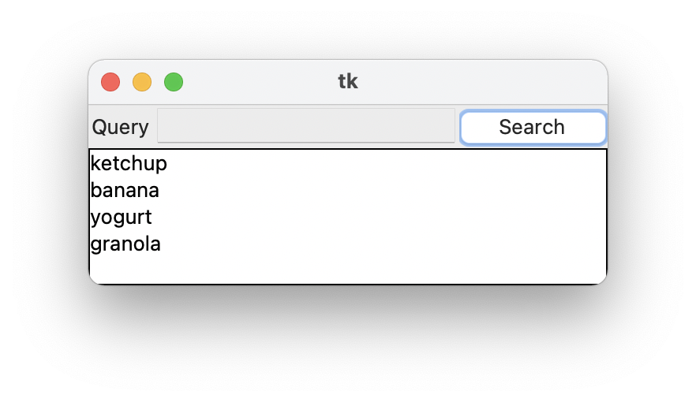
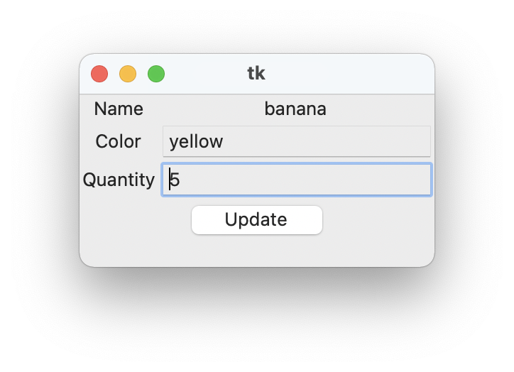

# event-example
Example of an asynchronous event bus.  This example accompanies an article on
asynchronous event buses that appears [here]().

This example demonstrates the core mechanisms
needed to handle long-running tasks asynchronously in a desktop gui application,
namely the need to dispatch potentially long running events to separate threads,
and add an element to ensure that synchronous events are run from the main
thread. The later is accomplished by making the event bus emit function
thread-safe by moving the incoming events to the main thread via a queue and a
callback in the gui event loop that is triggered when an event is waiting in the
queue.

This example is written in Python, and uses only Python standard library
components, so should be executable in any Python environment.

Library components used:

* tkinter - to model the GUI
* concurrent.futures - to dispatch asynchronous handlers to a separate thread
* queue - a thread-safe queue to ferry events between threads
* namedtuple - as a convenient data structure that provides instantiation and
  other boilerplate

This example is loosely inspired by the
[encore.events package]()
which provides a Python event bus, minus the asynchronous nature.

## How to run

To run, type in your terminal:

```bash
$ python -m event_example
```

Two windows should appear, a result window and a search window.  Run an empty
search in search window to get a list of results.  Click on a result and the
result will appear in the result window.  A two second delay is added to each
database operation to simulate a database query.

### Screen shots

A view of the search window:



A view of the result window:



### Testing the async nature of the application

To see that this would cause
the app to momentarily freeze, change the lines in "event_example/db.py" that
state `is_async=True` to `is_async=False`.  This will cause the app to become
unresponsive for two seconds with each database interaction.  This highlights
the importance of doing potentially blocking activities asynchronously in a gui
application.

## The code

The code is organized into a main script, the event
bus, the database, and two windows, search window and result window.

* `__main__.py`
  * Responsible for building the application.  All the other components are
    instantiated here.
  * Note that the three components, the database, the result window, and the
    search window, only depend on the event bus (and `Tk` for the windows), and
    not on each other.
* `eventbus.py`
  * The event bus definition. Depends on `tkinter` as it needs to be able to
    push events back to the main thread via a callback on the `Tk` event loop.
  * Provides mechanisms to connect functions to handle specific event classes.
  * Provides both a thread-safe emit function for dispatching events, `emit()`,
    and a thread-unsafe emit functions `syncemit()`.
* `events.py`
  * The event definitions to be sent along the event bus. The only constraint on
    events is that they are unique classes as only a `type` check is made in the
    event bus.
* `db.py`
  * The simulated database layer. Simulates a key-value store with an index.
    Depends on the event bus.
  * Connects handlers for events to trigger a search, a fetch, and an update in
    the database.
  * Emits events via the event bus to send out results of queries.
* `search.py`
  * A `Tk` window that allows searching for limited data in the database, and
    then notifying the application to load the full results of a record.
  * Connects a handler to the event bus for receiving search results.
  * Emits via the event bus search requests and fetch requests.
* `result.py`
  * A `Tk` window for displaying the full results of a record.
  * Connects a handler to the event bus for receiving a result record.
  * Emits an event to update the result in the database.
